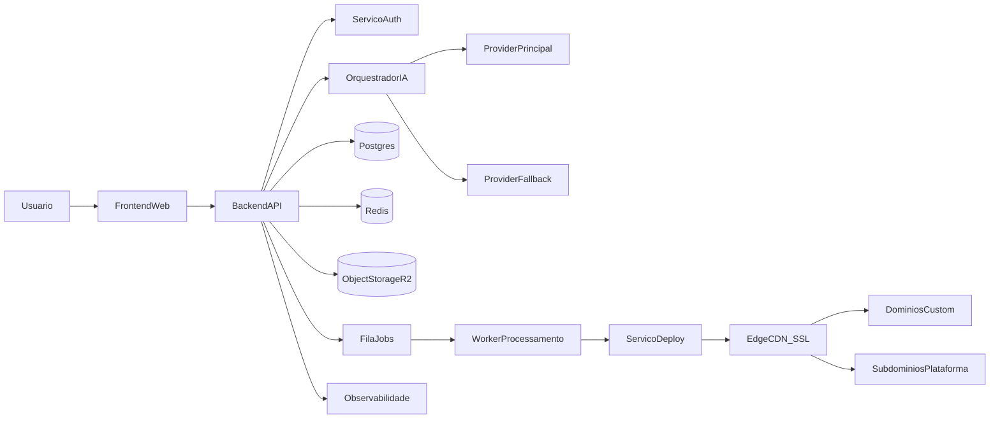

# 01 - Arquitetura e Infraestrutura

## 1. Objetivo tecnico
Definir uma arquitetura enxuta para lancar e operar um SaaS de geracao e clonagem de landing pages com IA, equilibrando:
- velocidade de entrega do MVP;
- baixo custo operacional inicial;
- capacidade de escalar sem reescrever componentes criticos.

## 2. Principios arquiteturais
- **API-first:** todo fluxo de geracao, clonagem e publicacao exposto via API versionada.
- **Multi-provider de IA:** orquestracao com fallback automatico entre modelos/provedores.
- **Isolamento por tenant:** dados e ativos segregados por workspace/conta.
- **Publicacao desacoplada:** geracao de pagina separada de deploy em dominio.
- **Observabilidade por evento:** cada etapa gera logs estruturados e metricas.

## 3. Arquitetura alvo (MVP -> Escala inicial)

## 4. Componentes de infraestrutura

### 4.1 Frontend
- Aplicacao web para onboarding, prompt, editor visual e publicacao.
- Entrega via CDN edge para latencia baixa.
- Preview em ambiente isolado (iframe sandbox) para seguranca.

### 4.2 Backend API
- Camada central de autenticacao, cobranca, plano e fluxos de pagina.
- APIs principais:
  - `POST /pages/generate`
  - `POST /pages/clone`
  - `POST /pages/{id}/publish`
  - `GET /jobs/{id}`
- Controle de idempotencia para evitar geracoes duplicadas.

### 4.3 Orquestrador de IA
- Normaliza prompts, define provider/modelo por politica de custo e qualidade.
- Executa retentativas com fallback e timeout por etapa.
- Registra telemetria por modelo: latencia, custo por chamada e taxa de erro.

### 4.4 Persistencia e assets
- **Postgres:** tenants, usuarios, paginas, versoes, jobs, limites de plano.
- **Object storage (R2/S3):** HTML final, assets, snapshots de versao.
- **Redis:** filas, locks distribuidos e cache de leitura frequente.

### 4.5 Publicacao e dominios
- Pipeline de deploy assincrono:
  1. validacao de integridade do bundle;
  2. upload de assets e manifesto;
  3. roteamento por tenant;
  4. configuracao de dominio e SSL.
- Suporte a subdominio gratuito e dominio proprio.

### 4.6 Observabilidade e seguranca
- Logs estruturados por `requestId`, `tenantId`, `jobId`.
- Tracing distribuido para etapas de IA e deploy.
- WAF, rate limit, protecao DDoS e validacao de input.
- Segredos em cofre e rotacao automatizada.

## 5. Funcao de IA: geracao e clonagem de paginas

## 5.1 Fluxo de geracao por prompt
1. Usuario informa objetivo, nicho e CTA.
2. Backend valida plano e cota mensal.
3. Orquestrador monta prompt estruturado com schema de saida.
4. Modelo gera estrutura semantica + copy + estilos base.
5. Pos-processamento converte para template editavel.
6. Validador de qualidade executa checks (responsividade, links, acessibilidade minima).
7. Sistema salva versao inicial e libera no editor.

## 5.2 Fluxo de clonagem por URL
1. Usuario informa URL de origem.
2. Coletor recupera HTML/CSS publico permitido.
3. Extrator identifica layout, secoes e hierarquia visual.
4. IA reescreve textos para evitar copia literal e adequar a nova proposta.
5. Gerador recompila pagina em componentes internos.
6. Validador detecta riscos de copyright, marcas e conteudo sensivel.
7. Preview e publicacao somente apos aprovacao do usuario.

## 5.3 Guardrails de IA (obrigatorios)
- Bloqueio de conteudo ilegal, enganoso ou sensivel por politica.
- Limite de tokens por job para previsibilidade de custo.
- Assinatura de versao de prompt e modelo para auditoria.
- Registro de confianca por secao gerada para revisao manual.

## 6. Requisitos nao funcionais (MVP)
- **Disponibilidade:** 99,5% mensal para API e publicacao.
- **Latencia:** p95 < 12s para gerar primeira versao de pagina.
- **Escalabilidade:** 10x aumento de jobs sem downtime.
- **Seguranca:** criptografia em transito e repouso, RBAC por tenant.
- **Custos:** limite diario de gasto de IA com corte automatico por tenant.

## 7. Decisoes de infraestrutura recomendadas
- Iniciar com arquitetura serverless/managed para reduzir tempo operacional.
- Evitar Kubernetes no MVP; adotar apenas apos demanda de escala recorrente.
- Padronizar deploy com infraestrutura declarativa (IaC) desde o inicio.
- Definir fallback de IA por custo e por latencia (duas politicas separadas).

## 8. Criterios de aceite da arquitetura
- Gera pagina nova em ambiente de producao com rastreabilidade de ponta a ponta.
- Executa clonagem com sucesso para URLs permitidas e bloqueia URLs proibidas.
- Publica em subdominio com SSL valido sem intervencao manual.
- Permite rollback de versao de pagina em ate 1 minuto.
