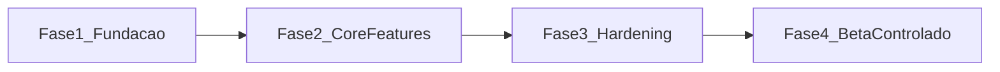

# 04 - Plano de Acao para Lancar MVP Beta em 20 Dias (YURI)

## 1. Meta de lancamento
Publicar um MVP beta funcional com:
- geracao de landing page por prompt;
- clonagem de pagina por URL com guardrails;
- edicao basica (texto, link, cor);
- publicacao em subdominio com SSL;
- instrumentacao minima de produto e operacao.

## 2. Premissas de execucao
- Time enxuto e dedicado durante 20 dias corridos de foco.
- Escopo congelado no dia 1; sem features fora do plano.
- Beta fechado com grupo controlado de usuarios.
- Uma stack principal, sem experimentacao paralela de framework.

## 3. Macrofases

- **Fase 1 (Dias 1-4):** fundacao tecnica e ambiente.
- **Fase 2 (Dias 5-12):** desenvolvimento de funcionalidades core.
- **Fase 3 (Dias 13-17):** hardening, seguranca e observabilidade.
- **Fase 4 (Dias 18-20):** beta fechado, correcoes finais e gate de release.

## 4. Cronograma detalhado (20 dias)

### Dias 1-2 - Setup e arquitetura baseline
- Definir repositorio, padrao de codigo, CI basico e ambientes.
- Provisionar Postgres, Redis, storage e secrets.
- Subir frontend e backend com autenticao inicial.
- Entregavel: skeleton funcional com deploy automatizado.

### Dias 3-4 - Dominio de negocio e contratos de API
- Modelagem de entidades (tenant, page, job, version, plan).
- Contratos das rotas de geracao, clonagem e publicacao.
- Estrutura de fila e workers.
- Entregavel: API versionada com contratos estaveis.

### Dias 5-7 - Geracao por IA
- Implementar orquestrador de IA com provider principal e fallback.
- Construir pipeline de prompt estruturado e validacao de resposta.
- Persistir versao inicial da pagina gerada.
- Entregavel: geracao por prompt operando ponta a ponta.

### Dias 8-10 - Clonagem por URL
- Implementar ingestao de URL e extracao estrutural da pagina origem.
- Reescrita assistida por IA com regras de compliance.
- Criar estados de job e erros orientativos.
- Entregavel: clonagem com preview funcional e logs auditaveis.

### Dias 11-12 - Editor e publicacao
- Editor basico de texto, links e cores.
- Pipeline de publicacao em subdominio e SSL automatico.
- Validacoes de integridade pre-publicacao.
- Entregavel: pagina editada e publicada sem etapa manual tecnica.

### Dias 13-14 - Seguranca e limites
- Rate limiting por tenant e protecao de endpoints sensiveis.
- RBAC minimo por perfil.
- Limites de uso por plano e corte de custo diario.
- Entregavel: governanca minima para operar beta com controle.

### Dias 15-16 - Observabilidade e qualidade
- Sentry, metricas de funil e dashboards de disponibilidade.
- Testes criticos de API, fluxo de geracao e fluxo de clonagem.
- Corrigir regressao de p0 e p1.
- Entregavel: baseline de confiabilidade para beta.

### Dia 17 - Preparacao de beta
- Criar playbook de suporte e runbook de incidente.
- Definir cohort de usuarios e criterios de onboarding.
- Entregavel: operacao pronta para receber usuarios beta.

### Dia 18 - Beta fechado (onda 1)
- Liberar para grupo pequeno e monitorar em tempo real.
- Coletar feedback de UX, qualidade e latencia.
- Entregavel: lista priorizada de ajustes finais.

### Dia 19 - Ajustes de alta prioridade
- Corrigir bugs bloqueadores e otimizar gargalos de latencia.
- Revisar regras de compliance que geraram falso positivo/negativo.
- Entregavel: versao candidata a release (RC).

### Dia 20 - Gate final e release beta
- Executar checklist de release.
- Aprovar criterios de pronto com lideranca.
- Publicar versao beta e iniciar rotina semanal de melhoria.
- Entregavel: MVP beta oficialmente no ar.

## 5. Criterios de gate (Go/No-Go)
- Fluxos core funcionam sem intervencao manual:
  - gerar pagina;
  - clonar pagina permitida;
  - editar e publicar em subdominio.
- Erro p0 aberto: zero.
- SLO do beta atendido por 48h consecutivas.
- Custo medio por geracao dentro da meta financeira.
- Suporte com runbook ativo e ownership definido.

## 6. Riscos principais e mitigacao
- **Atraso na integracao com provider de IA:** manter fallback pronto no dia 7.
- **Latencia acima do esperado:** reduzir payload e introduzir processamento assincrono.
- **Bloqueio de clonagem por compliance excessivo:** calibrar limiares com whitelist controlada.
- **Instabilidade no deploy/publicacao:** manter rollback automatico por versao.

## 7. Cadencia de acompanhamento
- Daily de 15 minutos (progresso, risco, bloqueio).
- Checkpoint executivo nos dias 7, 12 e 17.
- Reuniao de decisao Go/No-Go no dia 20.

## 8. Indicadores de sucesso do beta
- Tempo para primeira pagina publicada.
- Taxa de jobs concluidos (geracao e clonagem).
- Taxa de publicacao apos preview.
- Custo medio por job.
- NPS inicial dos usuarios beta.
